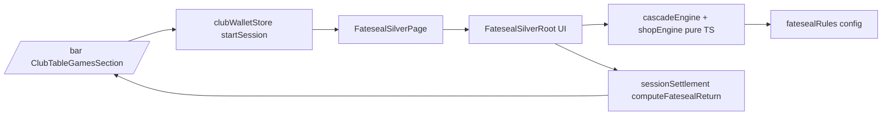

## Goal

Ship Fateseal Silver per [`Fateseal_Specs.md`](Fateseal_Specs.md) as a new club table at `/minigames/fateseal-silver`, fully integrated with the club wallet, specials, settlement cap math, and bar return state. Numbers not pinned by the spec (symbol list/weights, scatter threshold, shop prices, cascade multiplier ramp) are proposed in config with PDF-style comments and tuned via a Monte Carlo sim.

## Architecture (mirrors 7YI / Oubliette)

Pure engine and rules config live under `src/minigames/fateseal-silver/engine/` and `src/config/minigames/fatesealRules.ts`. The React root takes a `FatesealShellBinding` from the page (matching the 7YI pattern), reports `ClubTableReturnDetail` on cash-out, and the page calls `endSession` + navigates to `/bar` with `buildBarRouteStateFromReturn`.

## Phase 1 — Rules config + types

New file `src/config/minigames/fatesealRules.ts`:

- `SymbolId` union: 8 standard icons (`dagger`, `chalice`, `goat`, `eye`, `serpent`, `moon`, `flame`, `key`) + `wild`, `scatter`, `void`. Lore strings parallel to `sevenYearItchRackets`.
- `defaultSymbolPool: Array<{ id: SymbolId; weight: number }>` — proposed weights tuned by the sim (Phase 6). Standards ~10, wild ~3, scatter ~2, void starts at 0 (added by Faustian Bargains).
- Per-symbol payout multipliers (defaults to Single Focus 10x base bet, Triple Focus 1x base bet per spec §3B; per-symbol multiplier table allows per-icon tuning).
- `cascadeMultipliers: number[]` — e.g. `[1, 2, 3, 5, 8, 13]` ramping per consecutive cascade.
- `adjacencyMatchMinRun: 3` for "standard 3-of-a-kind adjacent matches" (orthogonal flood fill, Wild substitutes).
- Scatter mechanics: `scattersToTriggerRitual: 5`, `freeRitualSpins: 8`, `freeRitualGuaranteeWilds: 2` (proposed).
- Crossroads cadence: `crossroadsEveryNSpins: 3` (per spec §4).
- Shop offers (proposed):
  - **Faustian Bargain** — grants `Math.floor(buyIn * 0.15)` credits; permanently appends 3 voids to the pool.
  - **Silver Vision** — promotes one chosen standard symbol to wild for the rest of the session; cost `Math.floor(buyIn * 0.20)`.
  - **The Forbidden Tome** — doubles scatter weight for next 3 spins; cost `Math.floor(buyIn * 0.10)`.

All proposed numbers carry comments referencing the spec section they implement, so the tuning pass can update them in one place.

## Phase 2 — Pure engine (`src/minigames/fateseal-silver/engine/`)

- `cascadeEngine.ts`
  - `type Grid = (SymbolId | null)[][]` (5x5)
  - `type GameState = { grid; symbolPool; activeProphecy; bet; spinCount; sessionWallet; cascadeMultiplier; freeRitualSpinsLeft; tomeSpinsLeft; }` (per spec §5).
  - `rollGrid(rng, pool)`, `evaluateGrid(grid, prophecy)` returning matched cells + payout.
  - `applyGravity(grid)` — non-null cells fall to lowest empty y per column (voids do NOT shift; they occupy permanently per spec §3A).
  - `inflow(grid, rng, pool)` — fill empties from top (skipping void-occupied cells).
  - `runCascadeStep(state)` recursive until no matches; emits an audit log of cascade hits for the UI.
- `shopEngine.ts` — `applyBargain(state, choice)` — pure transforms on `symbolPool` and `sessionWallet`.
- `prophecy.ts` — `placeProphecy(state, mode: "single" | "triple", picks)` validates + clears.
- Injectable RNG `() => number` for deterministic Vitest. No React imports.
- Tests under `src/minigames/fateseal-silver/engine/__tests__/`:
  - Single Focus pays 10x per match; Triple pays 1x per match across 3 picks.
  - Cascade multiplier ramps and resets between spins.
  - Wilds substitute for prophesied symbols (and adjacency matches).
  - Voids are immune to match, immune to gravity, occupy slots permanently.
  - Scatters trigger Free Ritual at threshold; Tome doubles scatter weight for N spins; Faustian adds voids.

## Phase 3 — Economy + specials + settlement

- Extend [`src/config/villainsGameDefaults.ts`](src/config/villainsGameDefaults.ts) with a `fatesealSilver` block (`defaultBuyIn`, `maxReturnMultipleOfBuyIn`, overachievement mirror of Oubliette).
- Extend [`src/game/specialsResolver.ts`](src/game/specialsResolver.ts):
  - Add `fateseal_cap_mult?: number` to `SpecialDefinitionRow`.
  - `capModifiersFromSpecialDefinition` returns `fatesealCapMult`.
- Extend [`src/game/sessionSettlement.ts`](src/game/sessionSettlement.ts):
  - `buildFatesealSettlementProfile(buyIn, now)` (uses `fateseal_cap_mult * all_minigames_cap_mult`).
  - `getFatesealBaseReturnCeiling` + `computeFatesealReturn` (delegates to existing cap math).
  - New `FatesealShellBinding = { sessionCredits, settlement, onReturnToClubMenu, onPauseToClub }`.
- Extend [`src/game/barRouteState.ts`](src/game/barRouteState.ts) `tableReturnTagline` with a `fateseal_silver` branch (lore-flavored copy: "The seal closed in your favor…", etc.).
- Optionally add a `fateseal_cap_mult` to one or two existing entries in [`content/specials.json`](content/specials.json) (e.g. `grand_opening: 1.05`).

`TableSession['settlement']` already shares the same shape across games, so no union widening is needed.

## Phase 4 — Shell wiring

- [`src/components/club/ClubTableGamesSection.tsx`](src/components/club/ClubTableGamesSection.tsx):
  - `startFateseal` mirroring `startSevenYearItch`; uses `gameId: "fateseal_silver"`, `drinkId: "fateseal_silver"`.
  - "Table still open" alert when `activeSession?.gameId === "fateseal_silver"`.
  - New "Fateseal Silver (cascading slot)" button + ceiling copy.
  - Updated test in `__tests__/ClubTableGamesSection.test.tsx`.
- New `src/pages/FatesealSilverPage.tsx` mirroring [`src/pages/SevenYearItchPage.tsx`](src/pages/SevenYearItchPage.tsx): lazy root, `MinigameLazyErrorBoundary`, session guard, return handler.
- [`src/App.tsx`](src/App.tsx) — add `<Route path="/minigames/fateseal-silver" element={<FatesealSilverPage />} />`.

## Phase 5 — React UI (`src/minigames/fateseal-silver/`)

Three-panel layout per spec §6, Mantine + club tokens + a local `fateseal.css` for the gothic palette (charcoal stone, silver, blood crimson, void black).

- **Left — Prophecy Altar**: Mode toggle (Single Focus / Triple Focus), grid of selectable symbols, "Seal the prophecy" button. Disabled while a spin/cascade is animating.
- **Center — 5x5 stone tablet**:
  - Symbol cells with subtle ritual styling.
  - Cascade animation: matched cells crack/burn → gravity drop → inflow from above. Honors `prefers-reduced-motion` (instant transitions when reduced).
  - Void cells render as swirling holes with a "pulling" CSS animation that vibrates orthogonal neighbors (spec §6).
  - Onboard `onCascadeComplete` gate so player input is locked until the engine signals quiescence.
- **Right — Ledger**: Session credits, base bet stepper, current cascade multiplier, "Spins until Crossroads" countdown, recent payouts feed (mirrors 7YI roll wire).
- **Modals**:
  - Crossroads (every 3 spins) — three Bargain cards.
  - Free Ritual bonus — banner + remaining spins, auto-resolves.
  - Save / cash out (cash-out allowed only between spins, no active prophecy + no in-flight cascade — analogous to 7YI's "no point active" gate).

Audio: SFX-only via `clubAudioStore` (`useThemeAudio` style hook is optional; v1 can use a single thrum-on-cascade asset placeholder). Shell band keeps playing through the page (no in-minigame BGM).

## Phase 6 — Monte Carlo tuning

- `scripts/sim-fateseal.mts` (registered as `npm run sim:fateseal`) drives the engine for N=50k spins per profile, reporting:
  - RTP at default weights, with and without Crossroads choices.
  - Distribution of session length / bust rate at default buy-in.
  - Sensitivity to scatter weight, cascade multiplier curve, void count.
- Use results to lock final defaults in `fatesealRules.ts`. Keep a fixed-seed Vitest regression to catch RTP regressions (≤1% drift).

## Phase 7 — Tests, docs, CI

- Vitest:
  - Engine (`cascadeEngine`, `shopEngine`, `prophecy`).
  - `computeFatesealReturn` math.
  - Updated `ClubTableGamesSection.test.tsx`.
- Playwright smoke (`e2e/`): `/bar` → start Fateseal → place prophecy → spin → cash out → assert return-to-bar state and balance change.
- Run `npm run lint`, `npm run test`, `npm run typecheck`; run `npm run test:e2e` since `/bar` and a production route change.
- Update [`PLAN.md`](PLAN.md) → Current status with Fateseal milestone, and [`AGENTS.md`](AGENTS.md) if any new commands (e.g. `npm run sim:fateseal`) ship. Refresh [`docs/architecture.md`](docs/architecture.md) only if the multi-minigame integration shape changes (it should not — same contracts).

## Risks / explicit non-goals for v1

- No real symbol art — placeholder Mantine icons / unicode glyphs; replace later when content lands.
- No persisted in-progress save (snapshot to `clubWalletStore` is **session wallet + spin count only**, not full grid). Resuming reopens the table at a fresh pre-spin state with the existing session wallet, mirroring 7YI's pause behavior.
- DLC/online content packs out of scope.
- Lay/secondary "side bets" out of scope; only Single/Triple Focus prophecy + scatter/free-ritual ship in v1.