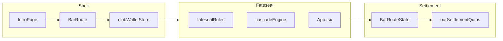

# Plan: TODO.md goals (strict order)

## Scope and ordering

You chose **roughly top-to-bottom** in [TODO.md](e:/LocalWorkspace/TheVillainsClub/TODO.md). The list below follows that sequence. Where bullets naturally share code paths (e.g. `BarRouteState` + all cash-out sites), they are grouped into one deliverable to avoid thrash.

**Deliverable file:** After you approve, write this plan verbatim (or export from Cursor’s plan UI) to **[`511plan.md`](e:/LocalWorkspace/TheVillainsClub/511plan.md)** at repo root, per your request.

---

## 1. Paused session: rejoin vs abandon (TODO §Updates)

**Current behavior:** Active table sessions live in [`src/game/clubWalletStore.ts`](e:/LocalWorkspace/TheVillainsClub/src/game/clubWalletStore.ts). [`ClubTableGamesSection`](e:/LocalWorkspace/TheVillainsClub/src/components/club/ClubTableGamesSection.tsx) already surfaces **Resume** per game when `activeSession` matches. [Fateseal / 7YI shell bindings](e:/LocalWorkspace/TheVillainsClub/src/game/sessionSettlement.ts) expose `onPauseToClub` for stepping back to the club without settling.

**Gap:** No explicit **Abandon table** path that ends the session with **no payout**, warns that **buy-in is lost**, and clears `activeSession` (and any game-specific resume snapshots on `TableSession`).

**Approach:**

- Add a deliberate **`forfeitActiveSession()`** (or equivalent) on the wallet store: clears session + snapshots, does **not** credit `clubBalance` with `sessionWallet` (stake forfeited; document in code comment to match product).
- UI: on `/bar` (and optionally `/menu` if it still lists open tables), next to Resume, add **Abandon** opening a **Mantine `Modal`** with the warning copy from TODO; confirm calls forfeit.
- Ensure each minigame page’s “no session → redirect” effects remain consistent with [`isReturningToClubRef`](e:/LocalWorkspace/TheVillainsClub/AGENTS.md) pattern so abandoning from the bar does not cause flicker or wrong redirects.
- **Vitest:** store behavior (forfeit clears session, club balance unchanged except no return of stake); light RTL test on bar abandon confirm if feasible.

---

## 2. Intro: “Enter the Club” transition (TODO §Updates)

**Current:** [`IntroPage.tsx`](e:/LocalWorkspace/TheVillainsClub/src/pages/IntroPage.tsx) drives phases `enter → hold → prompt → exit`, uses [`VcLogoIntroMark`](e:/LocalWorkspace/TheVillainsClub/src/components/intro/VcLogoIntroMark.tsx), navigates to `/bar` after exit timing. [`MenuHazeBackground`](e:/LocalWorkspace/TheVillainsClub/src/components/layout/MenuHazeBackground.tsx) is already present.

**Requested:** On **Enter the Club**: zoom so the **red** logo region fills the viewport → red holds → fade while **bar is already mounted behind** (so the menu is pre-rendered, not blank). Sequence detail: **red draws before grey text**; **neon flicker** on red intensifying until fill; glow fades while red fill stays; **then grey letters** fill.

**Approach:**

- **Routing/layout:** Either (a) mount the bar route in a hidden/low-opacity layer under the intro during `exit`, or (b) navigate to `/bar` earlier with intro as an **overlay** portal — pick the smallest change that preserves existing `/bar` data loading. Prefer **overlay on top of same parent** to avoid double data providers if that becomes an issue.
- **Logo component:** Extend `VcLogoIntroMark` (and related path constants in `vcLogoIntroPaths`) so draw order and fills are **sequenced** (red path animation first, grey letters after red+glow chapter). Add CSS variables or Framer sequences for **neon glow** (filter/glow + opacity keyframes), honoring **`usePrefersReducedMotion`** ([`usePrefersReducedMotion`](e:/LocalWorkspace/TheVillainsClub/src/motion/usePrefersReducedMotion.ts)): reduced path = short fade, skip flicker.
- **Timing:** Reuse or extend [`motionPresetStore`](e:/LocalWorkspace/TheVillainsClub/src/motion/motionPresetStore.ts) tunables so motion stays adjustable from the playground where applicable.
- **E2E:** If Playwright touches intro → bar, extend smoke to assert URL and a stable bar selector after entry (only if journey already covered).

---

## 3. Bar menu: logo at top (TODO §Updates)

**Target screen:** Intro navigates to **`/bar`** ([`IntroPage`](e:/LocalWorkspace/TheVillainsClub/src/pages/IntroPage.tsx)); confirm the actual “bar menu” layout lives in the **club menu on the bar route** (e.g. [`MainMenuPage`](e:/LocalWorkspace/TheVillainsClub/src/pages/MainMenuPage.tsx) “bar-menu” branch or dedicated bar page — verify during implementation; [`BarStubPage`](e:/LocalWorkspace/TheVillainsClub/src/pages/BarStubPage.tsx) may be a stub).

**Approach:** Add a compact **VC mark** header strip consistent with [`clubTokens`](e:/LocalWorkspace/TheVillainsClub/src/theme/clubTokens.ts) / Mantine spacing; no duplicate heavy animation — static or subtle mark.

---

## 4. Settlement quips: extreme win / extreme loss thresholds (TODO §Updates)

**Current:** [`barSettlementTone`](e:/LocalWorkspace/TheVillainsClub/src/game/barSettlementQuips.ts) uses simple multiples of buy-in and tiers (`extreme_win`: `fractionBack >= 3 || tiers >= 2`; `extreme_loss`: `fractionBack < 0.22` or zero).

**New rules:**

- **Extreme win:** only when return is within **5% of the game’s max win** for that session (use the same cap the table was opened with: `maxReturnMultipleOfBuyIn * capModifierProduct * buyIn` from [`OublietteSettlementProfile`](e:/LocalWorkspace/TheVillainsClub/src/game/sessionSettlement.ts), floored/rounded consistently with settlement math).
- **Extreme loss:** when player has lost **≥ 85%** of buy-in → equivalently **`totalReturn / buyIn <= 0.15`** (align rounding with existing `Math.round` patterns).

**Approach:**

- Extend [`BarRouteState`](e:/LocalWorkspace/TheVillainsClub/src/game/barRouteState.ts) `lastTable` with optional **`maxReturnCredits`** (or `maxWinCredits`) computed at **settle** time from the session’s settlement snapshot (already available on each minigame page when calling `navigate("/bar", { state })`).
- Update [`buildBarRouteStateFromReturn`](e:/LocalWorkspace/TheVillainsClub/src/game/barRouteState.ts) and **every** `navigate`/`buildBarRouteStateFromReturn` call site (Oubliette, 7YI, Fateseal pages) to pass the cap.
- Adjust `barSettlementTone` + **Vitest** for `barSettlementQuips` / `isBarRouteState` (tighten type guard for new optional field).

---

## 5. Fateseal Silver — backlog (TODO §Fateseal)

This block is **large**: it touches [`src/minigames/fateseal-silver/engine/cascadeEngine.ts`](e:/LocalWorkspace/TheVillainsClub/src/minigames/fateseal-silver/engine/cascadeEngine.ts), [`App.tsx`](e:/LocalWorkspace/TheVillainsClub/src/minigames/fateseal-silver/App.tsx), [`fatesealRules.ts`](e:/LocalWorkspace/TheVillainsClub/src/config/minigames/fatesealRules.ts), specs [`Fateseal_Specs.md`](e:/LocalWorkspace/TheVillainsClub/Fateseal_Specs.md), Monte Carlo [`scripts/sim-fateseal.ts`](e:/LocalWorkspace/TheVillainsClub/scripts/sim-fateseal.ts), and existing engine tests under [`engine/__tests__/`](e:/LocalWorkspace/TheVillainsClub/src/minigames/fateseal-silver/engine/__tests__/).

Recommended **sub-order** within Fateseal (still matches your TODO list intent, minimizes rework):

1. **Config surface first** in `fatesealRules.ts` / `resolveFatesealGameMode`: linking thresholds, bonus frequency, crossroads bonus symbol threshold (15), purchased reel lifetimes (wild 3, dead 5, mark 3), “bonus spin does not decrement purchased spin counters”, Sympathetic Vibrations payout (75× bet), grid expansion rules, dead-reel stacking rules, etc. Extend `fatesealGameConfig.gameModes` as needed so tests import constants ([`AGENTS.md`](e:/LocalWorkspace/TheVillainsClub/AGENTS.md) test rule).

2. **Engine: Free Ritual / bonus spin rework** — Today `freeRitualSpinsLeft` decrements per spin and `crossroadsGate: spinCount % 3 === 0` ([`cascadeEngine.ts`](e:/LocalWorkspace/TheVillainsClub/src/minigames/fateseal-silver/engine/cascadeEngine.ts)). Redesign state machine so:
   - Extra free spins **append to the current ritual** (resolve before spin fully ends).
   - **Dead reels** accrue per extra bonus round, removed after **all** bonus spins complete; distinguish **bonus-added** dead reels vs **other sources** (retain the latter).
   - **Grid grows** (+1 row +1 col per bonus tier); define max size / overflow behavior if chain hits 3+ bonuses.
   - **Fourth bonus trigger** in one round → **Sympathetic Vibrations** (75× bet), banner copy + 4s fade (UI layer can own timer; engine emits event).
   - **Bonus symbol count does not carry** between paid rounds (reset meter/count where applicable).
   - Retune scatter / bonus frequency per config.

3. **Symbol linking / cluster rules** — Non-selected symbols require **5** linked for removal; selected symbols **do not need links**; **+2× per linked matched symbol** (config-driven multiplier for future game types). Update cascade clear logic and payout aggregation; extend Vitest in [`cascadeEngine.test.ts`](e:/LocalWorkspace/TheVillainsClub/src/minigames/fateseal-silver/engine/__tests__/cascadeEngine.test.ts).

4. **Betting UI** — Replace bet textbox with four buttons (**Min**, **1/8**, **1/4**, **1/2** bankroll), disable bankroll buttons when computed bet `< minBaseBet`; clicking a bet button **starts the spin** (replaces separate “Start Omen” if that is the current primary action — reconcile with prophecy flow: likely bet chips → then prophecy if required, or single-button flow as product dictates).

5. **Prophecy: single pick only** — Enforce **one** symbol at outset; revisit payouts in config + `fatesealCascadePayoutScale` / sim for balance.

6. **Purchased reel lifetimes** — Wild 3, dead 5, mark 3 spins; bonus spins **excluded** from decrement (TODO line 38 says “3 spins” for dead reel bonus exclusion — treat **lifespan as 5** for dead per line 40; bonus exclusion wording applies to all three types).

7. **Presentation** — Larger ritual area, slightly slower animation timings (respect `prefers-reduced-motion`).

8. **Side ledger panel** — Scroll of recent payouts, current round win (incl. bonus chain), current bet, active symbols, **bonus symbols until crossroads**, wild/dead reel inventory + **remaining lifespan** counters.

9. **Crossroads rework** — Trigger after **15 bonus symbols revealed** (config), not every 3 spins — remove/replace `crossroadsGate: spinCount % 3` coupling. **Dedicated full screen** (not modal) with **once-per-visit** purchase limits. Shop SKUs and prices from TODO (omen symbol tiered pricing, wild reel, dead reel credit grant, mark) — all in config. Update [`App.tsx`](e:/LocalWorkspace/TheVillainsClub/src/minigames/fateseal-silver/App.tsx) routing between ritual / crossroads / ledger.

10. **Integration** — `npm run sim:fateseal` + RTP sanity; update [`Fateseal_Specs.md`](e:/LocalWorkspace/TheVillainsClub/Fateseal_Specs.md) and [`PLAN.md`](e:/LocalWorkspace/TheVillainsClub/PLAN.md) Current status when behavior shifts; Playwright if shell journey to Fateseal changes.

---

## Credit estimate (your account snapshot)

**Stated context:** **Pro** subscription, **$20 buy-up** on the usage pool for this cycle, and **~85% of that pool already consumed** — so roughly **15% of the combined (included + buy-up) allowance remains** before you hit the top of what that pool represents in Cursor’s usage UI.

**How this maps to the backlog (qualitative; Cursor does not expose exact per-agent-token dollars in chat):**

- **Where you sit:** You are **late in the billing cycle** from a budget perspective: most of Pro + buy-up is already spent, so **remaining headroom is a small slice** of the full pool (order-of-magnitude **one sixth** of the cycle budget if “85% used” is read literally).
- **§1–4 only (through settlement quips):** Often **fits within “the last ~15%”** of a Pro+buy-up pool *if* sessions use a cost-efficient model mix and avoid huge refactors — but it is **not guaranteed**; intro work (§2) is the main variable.
- **§5 full Fateseal redesign:** Realistically **unlikely to complete entirely inside the remaining ~15%** on sustained premium agent runs; expect either **multiple billing cycles**, **another buy-up / top-up**, or **overrun / on-demand usage** (if enabled in your account) for the long tail of engine + UI + tuning.

**Overrun:** You have not specified whether overage is allowed after 100% pool consumption. If **hard-capped**, plan for **pause or add credits** before the Fateseal-heavy phase. If **overrun is on**, work can continue past the pool at whatever overage rate Cursor applies — still worth watching the usage meter during long agent runs.

**Practical takeaway:** With **85% already used**, treat the **Fateseal** portion of this plan as **next-cycle or extra-budget work** unless you confirm overrun or add pool. Copy this subsection into [`511plan.md`](e:/LocalWorkspace/TheVillainsClub/511plan.md) when you export the plan.

**Rough work sizing (unchanged — for scope, not dollar precision):**

| Slice | Relative size |
|------|-----------------|
| §1 Pause/abandon + tests | Small |
| §2 Intro sequence + pre-mounted bar | Medium–large (animation + routing edge cases) |
| §3 Bar header logo | Small |
| §4 Quip thresholds + route state + call sites | Small–medium |
| §5 Entire Fateseal section | **Very large** (multiple engine state machines, UI screens, economy, tuning) |

---

## Risks and notes

- **Fateseal** changes invalidate existing tuning (`fatesealCascadePayoutScale`, scatter cadence); expect **sim + manual play** iterations.
- **TODO line 39 vs 40:** Treat purchased **dead reel** lifetime as **5 spins**; “does not count towards the 3 spins” in line 39 is interpreted as **bonus spins excluded from purchased-reel decay** (same pattern as wild/mark).
- **Crossroads “15 bonus symbols”** needs a precise definition in engine (lifetime counter vs revealed-on-grid) before coding.
