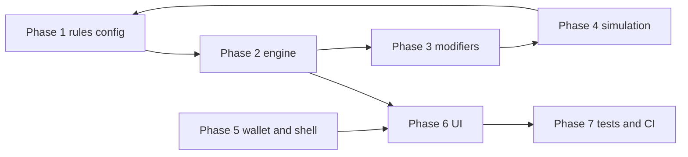

# 7 Year Itch — Agent implementation plan

This document is the **source of truth for coding agents** implementing the **7 Year Itch** minigame (noir-themed **Crapless Craps**). Product flavor lives in **`7_Year_Itch_Specs.md`**. Shell conventions, commands, and repo expectations live in **`AGENTS.md`** and **`PLAN.md`**.

---

## 1. References

| Document | Role |
|----------|------|
| `7_Year_Itch_Specs.md` | Narrative framing, UX tone, Favors / Devil’s Deals, UI metaphors (case file, heat, palette). |
| [Nevada Gaming — Crapless Craps (PDF)](https://www.gaming.nv.gov/siteassets/content/divisions/enforcement/rules-of-play/Crapless_Craps.pdf) | **Authoritative base rules** for flow and paytables (implement math from here unless design explicitly overrides). |
| `AGENTS.md` | Electron/Vite stack, lint/test/typecheck/e2e, bar vs menu routing, wallet/session pattern. |
| `src/pages/OublietteNo9Page.tsx`, `src/components/club/ClubTableGamesSection.tsx` | **Templates** for minigame page + bar buy-in. |

---

## 2. Official Crapless Craps (NV rules summary)

Crapless is dealt like **standard Craps** with these **exceptions** (verbatim sense from the PDF):

### Come-out

- **7** is the **only Pass Line winner** on the come-out and pays **even money** (1:1).
- **All other totals** (2–6, 8–12) become the **point** — no automatic win/loss on **2, 3, 11, or 12** on the come-out (unlike standard craps).

### Free odds (behind Pass, once a point is established)

- **2 and 12:** **6 to 1**
- **3 and 11:** **3 to 1**
- **All other points:** same odds as **standard Craps**.

### Place bets on 2, 3, 11, 12

When offered as place numbers:

- **2 and 12:** **25 to 5** (equivalently **5 for 1** on the winning amount in common phrasing).
- **3 and 11:** **13 to 5**

### Other

- **No Don’t Pass** and **no Don’t Come**.
- **All other bets** unchanged from standard Craps (for numbers you implement: use **standard place / odds** schedules for 4–6, 8–10 as applicable).
- **Lay** may or may not be offered; if offered, **5% vig** — optional for v1.

### Alignment with `7_Year_Itch_Specs.md`

| Spec concept | Crapless behavior |
|--------------|-------------------|
| “Investigation” (come-out) | Come-out roll: **7** = Pass wins even money, **no point**; any other total **sets the point**. |
| “The Bust” (7) after point | **Seven** loses Pass (and typical table bets) — standard **point cycle** loss. |
| “Success” (hit the point) | Pass wins; new come-out. |
| Rackets / number map | UI names only; **payouts** follow **NV crapless + standard craps** for the bet types you ship. |

**Agent rule:** Implement **NV math and transitions first**; **Favors** and **Devil’s Deals** are a **modifier layer on top**, applied after (or instead of) a resolved legal outcome only where the design says so — keep base resolution testable in isolation.

---

## 3. Open design decisions (resolve before or during Phase 1)

1. **Scope of bets v1:** Pass (+ odds only?) vs Pass + full place grid including 2/3/11/12 per PDF.
2. **Devil’s Deal — “Aggressive Expansion”:** Does “empties bankroll” mean **session wallet only** (recommended for shell consistency) vs **persisted club balance**? Default recommendation: **session only** unless product explicitly wants hardcore wipe.
3. **Favor — “X rolls without a 7”:** Choose **X** and whether the streak counts **across** come-out and point phases or **resets per round**.
4. **Settlement shape:** Mirror **Oubliette** (`maxReturnMultipleOfBuyIn` + overachievement tiers from `sessionSettlement.ts`) vs a **simpler flat cap** for v1.
5. **Specials / caps:** Start with `all_minigames_cap_mult` only, or add a **`seven_year_itch_cap_mult`** (parallel to `oubliette_cap_mult`) in `specialsResolver.ts` + `content/specials.json`.

---

## 4. Repository integration map

### Current patterns (do not reinvent)

- **Bar entry:** `ClubTableGamesSection` → `useClubWallet().startSession({ gameId, drinkId, buyIn, settlement })` → `navigate('/minigames/...')`.
- **Session:** `TableSession` in `src/game/money.ts` — today `settlement` is typed as **`OublietteSettlementProfile` only**; second minigame needs a **discriminated union** or shared base + `gameId`-keyed settlement.
- **Return to bar:** Minigame calls `onReturnToClubMenu(detail: ClubTableReturnDetail)` → `endSession` → `navigate('/bar', { state: buildBarRouteStateFromReturn(...) })`.
- **Page shell:** Lazy-loaded root + `MinigameLazyErrorBoundary` + session guard if wrong/missing `activeSession` (see `OublietteNo9Page.tsx`).
- **Routing:** Register in `src/App.tsx`.

### New artifacts (planned layout)

| Area | Planned location / change |
|------|---------------------------|
| Rules config (paytables, limits) | `src/config/minigames/sevenYearItchRules.ts` (or adjacent) |
| Pure engine | `src/minigames/seven-year-itch/engine/` — dice, phases, bet resolution, **no React** |
| Modifiers | `src/minigames/seven-year-itch/modifiers/` — Favors, Devil’s Deals; **pipeline** with audit log |
| Simulation script | e.g. `scripts/sim-seven-year-itch.mts` or `src/minigames/seven-year-itch/sim/` + `package.json` script |
| UI | `src/minigames/seven-year-itch/` — Mantine + club tokens + local **dark amber** theme |
| Shell page | `src/pages/SevenYearItchPage.tsx` |
| Route | `/minigames/seven-year-itch` |
| `gameId` | Stable string, e.g. **`seven_year_itch`**, everywhere (store, specials, analytics) |
| Defaults / caps | `villainsGameDefaults` in `src/config/villainsGameDefaults.ts` |
| Settlement | `src/game/sessionSettlement.ts` — new profile builder + `computeSevenYearItchReturn` (or shared helper if identical math to Oubliette) |
| Bar copy | `src/game/barRouteState.ts` — extend `tableReturnTagline` for `gameId` **seven_year_itch** |

---

## 5. Implementation phases

### Phase 1 — Rules config + types

- Encode **NV come-out behavior** and **listed odds/place ratios** in config with **comments citing the PDF URL**.
- Add **standard craps** place/odds tables for 4–6, 8–10 from a single trusted reference (keep constants in one module).
- Document bet types supported in v1.

### Phase 2 — `CraplessEngine` (pure TypeScript)

- **State machine:** Come-out (no point) ↔ Point established (same shooter loop as craps).
- **Injectable RNG** `(rng) => [d1, d2]` for deterministic **Vitest**.
- **Resolution order:** roll → base crapless outcome → wallet deltas for each active bet type.
- **Tests:** come-out 7 pays pass; 2/3/11/12 become points; after point, 7 loses, point wins; spot-check payouts against config table.

### Phase 3 — Modifier pipeline (“hook system”)

Per `7_Year_Itch_Specs.md`:

- Ordered stages, e.g. `beforeResolve` → optional **Inside Man** (re-roll one die) → **Favor** on seven (consume shield — define exact behavior) → **Devil’s Deal** transforms (Kingpin’s Cut, Aggressive Expansion, partial seizure on 6/8 when active).
- **Output:** resolved totals, **structured audit log** (for UI strings + simulation CSV).

### Phase 4 — Monte Carlo + tuning

- Run **large-N simulations** (e.g. 10k–100k rolls) per modifier profile.
- Report bust rate, mean session length, ROI vs buy-in, tail risk; tune **X** for favors and deal side-effects if edges are broken.
- Prefer **fixed-seed Vitest** for regressions; keep heavy Monte Carlo in a **npm script**, not CI hot path.

### Phase 5 — Economy + wallet (shell)

- Extend **`villainsGameDefaults`** with `sevenYearItch` block (`defaultBuyIn`, cap multiple, optional overachievement mirror).
- **`buildSevenYearItchSettlementProfile`** + **`computeSevenYearItchReturn`** (or shared cap math).
- Widen **`TableSession['settlement']`** in `money.ts` to a **union**; ensure `startSession` / `endSession` type-narrows by `gameId`.
- **`ClubTableGamesSection`:** new table button, resume alert when `activeSession.gameId === 'seven_year_itch'`.
- **`App.tsx`:** new route.
- **Specials:** wire cap mults (see §3.5).

### Phase 6 — React UI

Per spec §5:

- **Case file / OPEN folder** metaphor for the active point.
- **Heat meter** (intensity vs time or rolls in point phase — formula in UI spec or design pass).
- **Dice** — physical feel; respect **`prefers-reduced-motion`** (see shell motion patterns).
- **Palette** — dark amber / whiskey noir; reuse `clubTokens` where possible.
- **Win / loss feedback** — stub SFX then wire `content/` when assets exist.

### Phase 7 — Quality gates (`AGENTS.md` checklist)

- **Vitest:** engine + settlement + one modifier path each.
- **Playwright:** `/bar` → start 7YI table → minimal play → settle → assert club balance / route.
- After code changes: **`npm run lint`**, **`npm run test`**, **`npm run typecheck`**; **`npm run test:e2e`** when bar routes or production build behavior changes.
- If a milestone lands: update **`PLAN.md` → Current status** (repo policy); do **not** duplicate full plan there — **link or point to this file**.

---

## 6. Dependency order (recommended)

**Vertical slice for early playable build:** Phases **1–2 + 5 (minimal)** + **thin UI** (roll + credits + leave table) before full polish and all modifiers.

---

## 7. Agent handoff checklist

When touching this feature set:

- [ ] Base crapsless resolution matches **NV PDF** for implemented bets; tests cite expected payouts.
- [ ] Modifiers are **separate** from base engine; tests cover **with and without** modifiers.
- [ ] `gameId` **`seven_year_itch`** (or chosen final id) is consistent in wallet, routes, and bar flash state.
- [ ] **`AGENTS.md`** quality commands run before handoff if code changed.
- [ ] **`PLAN.md`** updated if this minigame ships or materially changes milestones.
- [ ] No **JSONC** in browser `JSON.parse` paths without stripping (repo rule).

---

## 8. Changelog

| Date | Note |
|------|------|
| 2026-04-24 | Initial plan: merged original implementation plan + NV Crapless rules + agent integration map. |
