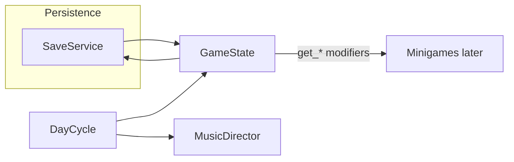

# Architecture (Phases 0–2)

## Autoload order

Defined in `project.godot`:

1. **DayCycle** → `core/day_cycle.gd` — effective local date string; `debug_calendar_offset_days` for QA.
2. **SaveService** → `core/save_service.gd` — `user://villains_club_save.json`, version + migration.
3. **GameState** → `core/game_state.gd` — credits, daily stipend, `content/specials.json`, `content/loans.json`, loan expiry (real-time unix).
4. **House band (shell)** → React `ShellBandMusicHost` in `src/audio/useShellBandMusic.ts` — reads **`content/bands.json`** + files under **`public/audio/bands/`**; **one band** active per local **“bar day”** (period **[4:00, next 4:00)**); shuffled full play-through of that band’s `music_files`, then refill; **random short interludes** between tracks per `interlude_chance_between_tracks`. **Keeps playing on `/minigames/*`** (same stream as menu/bar); respects **`clubAudioStore`** music mute/volume.

## Data flow (simplified)

## Minigame contract (next phases)

Minigames will read **payout** and **max wager** multipliers from `GameState` (`get_special_modifier_product()`, `get_max_wager_multiplier()`) and report outcomes back for credit updates.

## Web notes

Saves use `user://` (browser storage on HTML5). House music should start after a **user gesture** (“Enter bar” in the dev UI).
